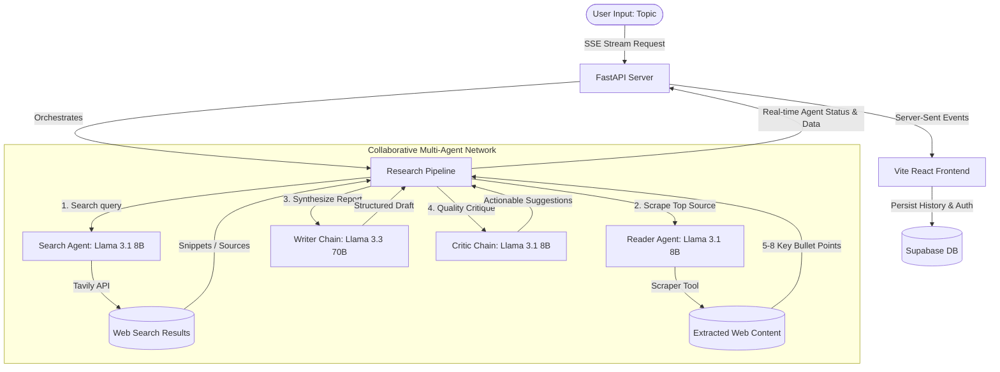

# Multi-Agent Research System (MARS)

An advanced, production-grade multi-agent research platform designed to orchestrate autonomous AI agents. The system utilizes a specialized pipeline to perform web search, deep content extraction, professional report generation, and rigid critique. It features a high-performance FastAPI backend leveraging ultra-fast cached LLMs (via Groq/Mistral) and a beautiful, modern React + TS + Vite + Tailwind CSS frontend backed by Supabase for authentication and session history.

---

## System Architecture



---

## Key Features

- **Specialized Multi-Tier LLM Architecture**:
  - **Llama 3.1 8B-Instant** (~1,000 tokens/sec) powers the high-speed Search, Reader, and Critic agents.
  - **Llama 3.3 70B-Versatile** handles complex structure and synthesis for high-quality report writing.
- **Streamed Agent Collaboration**: Utilizing Server-Sent Events (SSE), the backend streams agent thoughts, states, and completed datasets to the frontend in real time.
- **Secure User Authentication**: Full user signup/login flows powered by Supabase.
- **Session Persistence**: Automatically saves complete research steps (search, scrape, report, and review) to user history in Supabase.
- **One-Click Export**: Download fully formatted Markdown reports containing all agent stages.
- **Elite UI/UX Design**: Dynamic layout with smooth animations (Framer Motion), tailored dark theme colors (lavender, sage, gold accents), glassmorphism, responsive drawer menu, and professional Lucide Icons.

---

## Repository Structure

```text
MultiAjentSystem/
├── core/                  # Backend Engine (Python, FastAPI)
│   ├── app.py             # FastAPI App, SSE endpoints, Supabase Integration
│   ├── agents.py          # Cached LangChain Agents & LLM tier setups
│   ├── pipeline.py        # Pipeline orchestrator
│   ├── tools.py           # Web Search (Tavily) & Web Scraper (BeautifulSoup)
│   └── requirements.txt   # Python package dependencies
├── frontend/              # Web Client (React, Vite, TypeScript, Tailwind)
│   ├── src/
│   │   ├── pages/         # Research Dashboard & Auth pages
│   │   ├── icons.tsx      # Unified Lucide React exports
│   │   └── hooks.ts       # React hooks for history and auth state
│   ├── package.json       # Node.js dependencies
│   └── tailwind.config.js # Custom design tokens & colors
├── schema.sql             # Supabase database schema for history tracking
└── .env                   # Environment configurations (API keys)
```

---

## Setup & Installation

### Prerequisites

- Python 3.9+
- Node.js 18+
- Supabase project
- API keys for Groq (or Mistral) and Tavily

---

### 1. Database Setup (Supabase)

Run the commands inside [schema.sql](file:///d:/Yash%20Coding/ai%20learning/MultiAjentSystem/schema.sql) in your Supabase SQL Editor. This will provision the `research_history` table with proper row-level security (RLS) linked to Supabase auth.

---

### 2. Backend Setup

Navigate to the `core/` directory:

```bash
cd core
```

Create a `.env` file in `core/` (or the project root):

```env
# LLM Providers (Groq is preferred, Mistral as fallback)
GROQ_API_KEY=gsk_...
MISTRAL_API_KEY=your_mistral_api_key

# Web Search Provider
TAVILY_API_KEY=tvly-...

# Supabase Credentials (for verification/service operations if needed)
SUPABASE_URL=https://your-project.supabase.co
SUPABASE_ANON_KEY=eyJhbGci...
```

Install Python dependencies:

```bash
# Using virtual environment (recommended)
python -m venv .venv
.venv\Scripts\activate   # On Windows
source .venv/bin/activate # On Unix/macOS

pip install -r requirements.txt
```

Start the backend:

```bash
python app.py
```

The backend server runs on `http://localhost:8000`.

---

### 3. Frontend Setup

Navigate to the `frontend/` directory:

```bash
cd ../frontend
```

Create a `.env` file inside `frontend/`:

```env
VITE_SUPABASE_URL=https://your-project.supabase.co
VITE_SUPABASE_ANON_KEY=eyJhbGci...
VITE_API_URL=http://localhost:8000
```

Install frontend packages:

```bash
npm install
```

Launch the development server:

```bash
npm run dev
```

Open `http://localhost:5173` in your browser to start researching!

---

## Tech Stack

- **Frontend**: React 19, TypeScript, Vite, Tailwind CSS, Framer Motion, Lucide Icons, Marked (Markdown compiler).
- **Backend**: FastAPI (Python), LangChain ecosystem, Pydantic v2 (Strict inputs), Tavily API, BeautifulSoup4.
- **Database / Auth**: Supabase.

---

## Contributing

Contributions are what make the open source community such an amazing place to learn, inspire, and create. Any contributions you make are greatly appreciated.

1. Fork the Project
2. Create your Feature Branch (`git checkout -b feature/AmazingFeature`)
3. Commit your Changes (`git commit -m 'Add some AmazingFeature'`)
4. Push to the Branch (`git push origin feature/AmazingFeature`)
5. Open a Pull Request

---

## License

Distributed under the MIT License. See `LICENSE` for more information.

---

_Made by the Ayush Bunkar. Happy Researching!_
