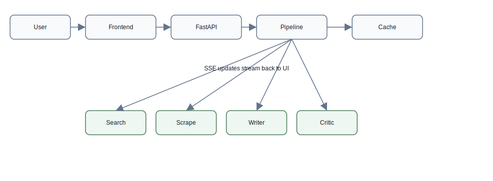
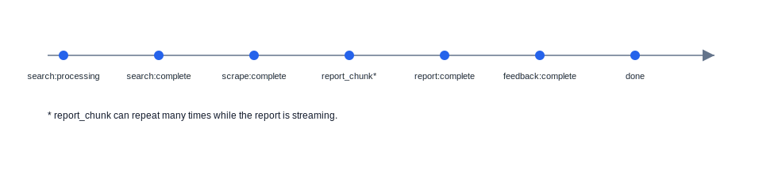
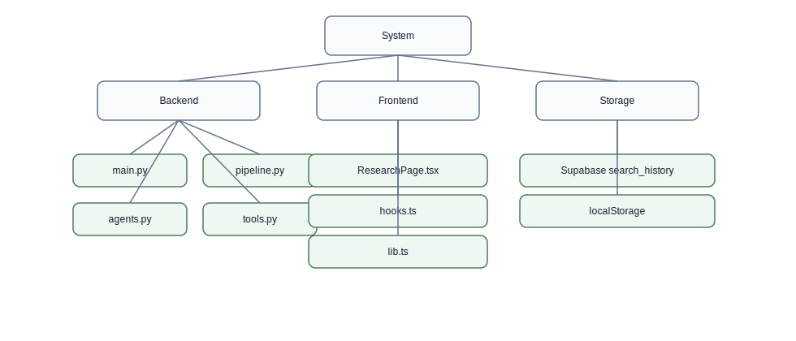
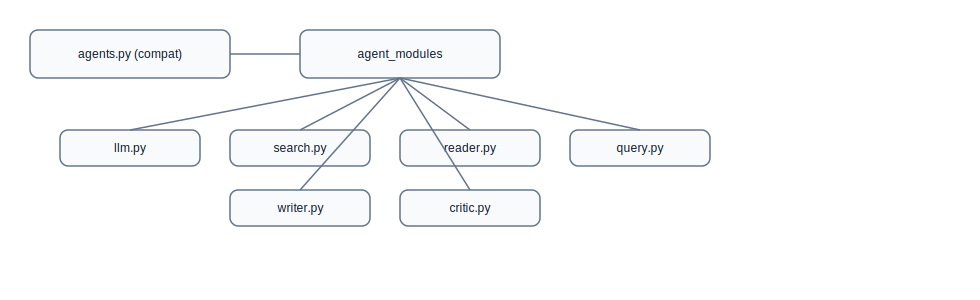
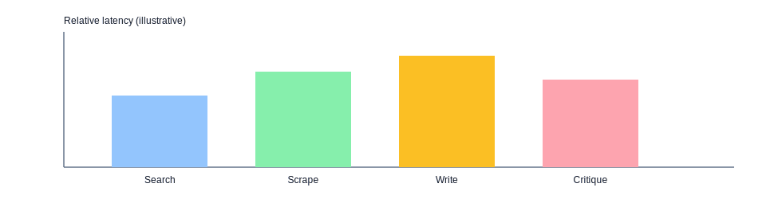
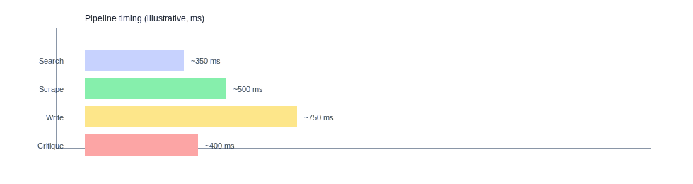

# Multi-Agent Research System - RAG Walkthrough
Date: 2026-05-25
Backend version: 3.0.0

## How to use this doc
- Use the end-to-end walkthrough to explain the system from entry point to output.
- Use the SSE deep dive to explain real-time streaming and UI updates.
- Use the query expansion and scraping deep dive to explain RAG behavior.
- Use the questions section for practice (easy, medium, hard).

## System maps (diagrams)








## Module layout and entrypoints
Backend agent code is modularized under core/agent_modules:
- llm.py: LLM factory and model tiers
- search.py: search agent
- reader.py: reader agent
- query.py: query expansion chain
- writer.py: writer chain
- critic.py: critic chain

ASGI entrypoints available:
- main:app
- core.main:app

## Real end-to-end walkthrough (example topic)
Example topic: Lithium iron phosphate batteries for grid storage (2024-2025)

Step 0 - Frontend opens stream
- UI creates an EventSource to:
  GET /api/research/stream?topic=Lithium%20iron%20phosphate%20batteries%20for%20grid%20storage%20(2024-2025)
- UI resets local state and shows the Search tab as active.

Step 1 - Backend accepts the request
- FastAPI validates the topic and starts the SSE pipeline.
- It immediately sends progress events for search and scrape.

Step 2 - Query expansion
- A fast LLM generates 3 diversified search queries.
- Example expanded queries (illustrative):
  - Lithium iron phosphate grid storage cost and cycle life 2024
  - LFP vs NMC for grid storage safety and performance
  - Utility scale LFP deployments and market trends 2025

Step 3 - Search + URL harvesting
- For each query, the system calls Tavily search for snippets.
- It also collects top URLs per query and deduplicates them.

Step 4 - Concurrent scraping
- The pipeline scrapes up to 4 unique URLs concurrently.
- It extracts readable text and caps each source to save tokens.

Step 5 - Report generation (streamed)
- The writer chain receives combined search + scrape text (capped).
- It streams report chunks over SSE (report_chunk events).

Step 6 - Critique
- The critic chain reviews the report and outputs actionable feedback.

Step 7 - Done event
- The server emits a done event with cached=false and duration_ms.
- The UI stores the result in history (Supabase or localStorage).

## API reference (backend)
All paths are relative to the backend root.

- GET /
  - Purpose: Serve the built frontend if available.
  - Output: HTML or a small JSON message.

- GET /api/research/stream
  - Purpose: Run the pipeline with real-time SSE updates.
  - Query params: topic (required, max 500 chars).
  - Output: text/event-stream (SSE).

- POST /api/research
  - Purpose: Run the pipeline and return a single JSON response.
  - Body: { "topic": "..." }
  - Output: JSON with search_results, scraped_content, report, feedback.

- GET /api/health
  - Purpose: System health check (LLMs, Tavily key, internet, cache stats).
  - Output: JSON with per-check status.

- POST /api/cache/clear
  - Purpose: Clear the in-memory result cache.
  - Output: JSON with cleared count.

- GET /api/config
  - Purpose: Public config for the frontend.
  - Output: Supabase URL and anon key.

## SSE event stream deep dive
Event schema:
{
  "step":   "search | scrape | report | report_chunk | feedback | cache | done | error",
  "status": "processing | complete | streaming | error",
  "data":   "string payload (may be empty)"
}

Typical cache-miss sequence (illustrative):
- search:processing
- scrape:processing
- search:complete (search snippets)
- scrape:complete (combined scrape text)
- report:processing
- report_chunk:streaming (many times)
- report:complete (full report)
- feedback:processing
- feedback:complete (critique)
- done:complete ({"cached":false,"duration_ms":12345})

SSE example payloads:
```
data: {"step":"search","status":"processing","data":""}

data: {"step":"search","status":"complete","data":"..."}

data: {"step":"report_chunk","status":"streaming","data":"# Title\n"}

data: {"step":"done","status":"complete","data":"{\"cached\":false,\"duration_ms\":12345}"}
```

UI handling summary:
- report_chunk appends to the report text in real time.
- complete events set the tab status to complete and switch the active tab.
- done closes the stream and saves history.
- error shows a banner and stops streaming.

## Query expansion + scraping deep dive
Query expansion
- The chain uses a fast LLM to output 3 distinct query lines.
- The pipeline takes up to 3 queries; if none, it falls back to the topic.

Search and URL harvesting
- For each query, the system requests Tavily search snippets.
- It also pulls top URLs per query (default 2 per query in pipeline).
- URLs are deduplicated while preserving order.

Scraping
- Up to 4 unique URLs are fetched concurrently via httpx.
- HTML is cleaned by removing noise tags (nav, footer, script, etc).
- Content is extracted from article/main if present.
- Each source is capped to 1500 chars before merging.

Why this design
- Query expansion improves breadth and reduces blind spots.
- Concurrent scraping minimizes latency.
- Caps keep token usage predictable.

## Caching and performance
- Result cache key is MD5 of normalized topic.
- TTL is 1 hour and max entries is 30.
- Search and scrape tools also have their own TTL cache (1 hour).
- Startup warms LLM clients to reduce first-request latency.

## Data persistence (history)
- With Supabase: search_history table stores all fields and user_id.
- Without Supabase: localStorage stores history per local user id.

## Short walkthrough script (60 seconds)
"The UI opens an SSE stream to the backend. The backend expands the topic into a few search queries, then runs Tavily search and scrapes the top URLs in parallel. It combines the search and scrape text, streams the report as it is written, then runs a critique step. Each step sends SSE events so the UI can show progress live. When done, the results are cached and saved to history."

## Troubleshooting
- If /api/health shows Tavily missing, set TAVILY_API_KEY in .env.
- If streaming fails, confirm the backend is running and CORS is allowed.
- If reports are short, increase MAX_RESEARCH_CHARS in pipeline.py.
- If scraping is blocked, try different user agents or adjust timeouts.

## Practice questions and answers

### Easy (30)
1. Q: What is the main goal of this system?
   A: Turn a topic into a report using search, scrape, write, and critique.
2. Q: Which backend framework is used?
   A: FastAPI.
3. Q: Which frontend stack is used?
   A: React + Vite + TypeScript + Tailwind.
4. Q: Which endpoint streams progress?
   A: GET /api/research/stream.
5. Q: Which endpoint returns a single JSON response?
   A: POST /api/research.
6. Q: What does SSE stand for?
   A: Server-Sent Events.
7. Q: What does the writer chain output?
   A: A structured Markdown report.
8. Q: Which service provides web search?
   A: Tavily.
9. Q: What tool fetches and cleans page text?
   A: web_scrape in tools.py.
10. Q: Where is the research pipeline defined?
    A: core/pipeline.py.
11. Q: Where are LLM models configured?
    A: core/agent_modules/llm.py.
12. Q: Which model tier writes the report?
    A: llama-3.3-70b-versatile (Groq) when configured.
13. Q: Which model tier handles search and critique?
    A: llama-3.1-8b-instant.
14. Q: What is stored in the result cache?
    A: search_results, scraped_content, report, feedback.
15. Q: What is the cache TTL?
    A: 1 hour.
16. Q: What does /api/health check?
    A: LLMs, Tavily key, internet, cache stats.
17. Q: Where does the UI open the SSE connection?
    A: ResearchPage.tsx.
18. Q: What happens if Supabase is not configured?
    A: Local mode uses localStorage.
19. Q: What is the max topic length allowed?
    A: 500 characters.
20. Q: Which SSE event carries streaming text?
    A: report_chunk.
21. Q: What is the final SSE event?
    A: done with cached and duration_ms.
22. Q: How is the cache key derived?
    A: MD5 of normalized topic.
23. Q: How many search results are requested per query?
    A: 4.
24. Q: How many expanded queries are used?
    A: Up to 3.
25. Q: How many URLs are scraped?
    A: Up to 4.
26. Q: Where is HTML content cleaned?
    A: _extract_text in tools.py.
27. Q: What is the SSE response content type?
    A: text/event-stream.
28. Q: Why add GZip middleware?
    A: Compress responses over 500 bytes.
29. Q: What header is added for tracing?
    A: X-Request-ID.
30. Q: Where is the Supabase client created?
    A: frontend/src/lib.ts.

### Medium (30)
1. Q: Describe the SSE flow for a cache miss.
   A: It emits search/scrape processing, then complete, report processing with report_chunk streaming, report complete, feedback processing/complete, then done with duration.
2. Q: Why run search and scrape in parallel?
   A: Reduce latency by overlapping IO.
3. Q: How does query expansion improve search?
   A: It generates diverse queries to widen coverage.
4. Q: How are duplicate URLs removed?
   A: Using a seen set while preserving order.
5. Q: Why cap research input to 4000 chars?
   A: Control token usage and latency.
6. Q: Why cap critic input to 2000 chars?
   A: Save tokens while focusing on structure.
7. Q: What is the difference between report_chunk and report events?
   A: report_chunk streams partial text; report is the final full report.
8. Q: How does the UI decide which tab is active during streaming?
   A: It sets activeTab to report when report_chunk arrives or when a step completes.
9. Q: What happens if the SSE stream errors?
   A: The UI shows an error banner, stops streaming, and resets loading state.
10. Q: Why warm up LLMs in lifespan?
    A: Reduce first-request latency by caching model clients.
11. Q: How does the backend avoid blocking the event loop with LangChain?
    A: It uses asyncio.to_thread or run_in_executor.
12. Q: Why use separate LLM tiers for search vs writer?
    A: Fast model for speed, larger model for quality.
13. Q: What data is stored in Supabase search_history?
    A: topic, search_results, scraped_content, report, feedback, user_id, created_at.
14. Q: What triggers history save in the UI?
    A: The done event from SSE.
15. Q: How does local mode store history?
    A: localStorage keyed by user id.
16. Q: Why include Tavily direct answers?
    A: Provide concise summary and context.
17. Q: How does the scraper select content region?
    A: It prefers article, main, or role=main elements.
18. Q: Why rotate user agents?
    A: Reduce 403s and improve fetch success.
19. Q: How is SSE caching handled?
    A: A cache hit emits cache and then completes immediately.
20. Q: What is the purpose of the X-Accel-Buffering header?
    A: Prevent proxy buffering for real-time SSE.
21. Q: How does the pipeline handle errors in a stage?
    A: It catches exceptions and returns placeholder text so the pipeline completes.
22. Q: What is the effect of the GZip minimum size?
    A: Skip compression for very small responses.
23. Q: Why limit each scraped source to 1500 chars?
    A: Reduce token load and improve write performance.
24. Q: How does the UI render Markdown safely?
    A: It uses marked and inserts HTML; for untrusted content consider sanitizing.
25. Q: What is the difference between /api/research and /api/research/stream for the UI?
    A: The stream provides live updates; JSON is a single response.
26. Q: Why is cache max entries limited?
    A: Avoid unbounded memory use.
27. Q: How does the pipeline choose how many URLs to scrape?
    A: It takes the first 4 unique URLs.
28. Q: What is the role of _stream_write?
    A: Stream report chunks from the writer chain.
29. Q: Why does critique strip preambles?
    A: Keep feedback concise and actionable.
30. Q: What conditions make /api/health status degraded?
    A: Any check not ok or configured.

### Hard (30)
1. Q: If the search tool returns empty results, how should the pipeline behave and why?
   A: It should still proceed and generate a report using available context or return a clear fallback; this keeps the UX consistent.
2. Q: What would break if you replaced SSE with WebSockets?
   A: The UI would need a different client, server code, and infrastructure; SSE is simpler for one-way streaming.
3. Q: How would you prevent repeated scraping of identical URLs across users?
   A: Add a shared URL-level cache with TTL and normalized URL keys.
4. Q: What is the risk of using localStorage for history in local mode?
   A: Data is per-browser and can be cleared; no cross-device sync.
5. Q: Where are the main bottlenecks in the pipeline and how would you measure them?
   A: Search, scraping, and writing; measure with timing logs and tracing.
6. Q: How does using run_in_executor affect throughput under load?
   A: It uses a thread pool; too many blocking tasks can exhaust threads.
7. Q: Why not make web_scrape fully async as a tool?
   A: LangChain tools are sync; the wrapper avoids event loop conflicts.
8. Q: How would you add source citations to the report?
   A: Pass URL list and snippets to the writer and require citations in the prompt.
9. Q: What is the failure mode if Tavily API key is missing?
   A: Search errors; health check shows missing.
10. Q: How can you reduce hallucinations in the writer?
    A: Tight prompts, lower temperature, include sources, add citations.
11. Q: How would you test SSE streaming end-to-end?
    A: Use an SSE client, capture events, and assert order and final done event.
12. Q: What is the effect of lowering MAX_RESEARCH_CHARS to 2000?
    A: Less context, faster but potentially lower report quality.
13. Q: How does request ID middleware help debugging?
    A: It correlates logs across requests and services.
14. Q: Why is cache keyed on normalized topic instead of raw?
    A: Avoid duplicate entries due to case or spacing.
15. Q: What race conditions could occur in the result cache?
    A: Concurrent reads/writes; asyncio.Lock prevents them.
16. Q: How would you implement per-user cache isolation?
    A: Include user id in the cache key and store per-user entries.
17. Q: How can you avoid blocking on writer streaming if client disconnects?
    A: Check connection state and cancel tasks on disconnect.
18. Q: Why is httpx.AsyncClient created once in lifespan?
    A: Reuse connections and reduce overhead.
19. Q: What is the tradeoff of caching report outputs?
    A: Saves time but can serve stale data if the topic meaning shifts.
20. Q: How would you add rate limiting to the API?
    A: Use middleware or a gateway with per-IP or per-user limits.
21. Q: What risk exists in rendering Markdown to HTML directly?
    A: XSS if untrusted content; sanitize or restrict sources.
22. Q: How does the pipeline avoid blocking the FastAPI event loop?
    A: It offloads blocking calls to threads.
23. Q: What would you change to support multi-lingual queries?
    A: Adjust prompts, search language, and optionally a translation step.
24. Q: How could you add a retry on scrape error policy?
    A: Retry with backoff and fallback URLs for transient errors.
25. Q: What is the difference between cache TTL and cache max?
    A: TTL expires by time; max evicts oldest when full.
26. Q: How would you store SSE progress in Supabase for later playback?
    A: Persist each event with timestamps and step IDs.
27. Q: How can you detect and prevent duplicate done events?
    A: Track completion state per request and avoid double emits.
28. Q: What is a safe way to expose public config to the frontend?
    A: Use anon keys only; never expose service role keys.
29. Q: How would you make the pipeline resumable after a crash?
    A: Persist intermediate state and re-run remaining steps.
30. Q: What is the impact of raising max_tokens for writer to 4096?
    A: More detail but slower and higher cost.
